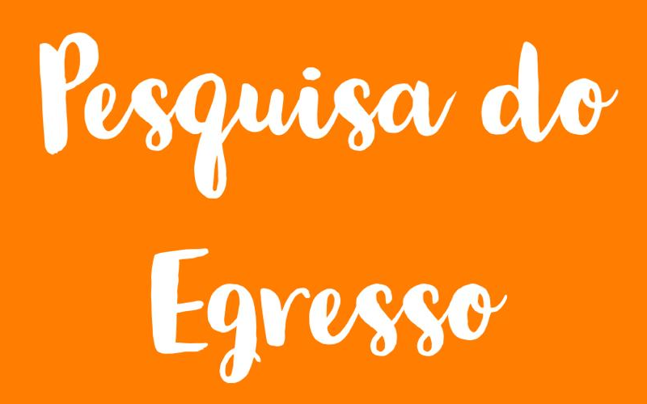

<!--install and/or load all R packages-->
```{r setup, include = FALSE, echo = FALSE, warning = FALSE, message = FALSE, fig.align = 'center', out.width = "100%", results = "hide"}
knitr::opts_chunk$set(
  echo = FALSE,
  warning = FALSE,
  message = FALSE,
  fig.align = 'center',
  results = "asis",
  include = TRUE,
  out.width = "100%",
  knitr.kable.NA = '--',
  knitr.table.format = "html"
)
source("Scripts/all-required-packages.R", local = knitr::knit_global())
```

<!--script for inserting LOGO ABOVE THE TOC-->
```{js}
$(document).ready(function() {
  $('#TOC').parent().prepend('<div id=\"nav_logo\"></div>');
  });
```

<!--script for sharing-->
<p align="right">
```{r share}
home <- "https://ppgcr-unisuam.github.io/observatoriocr/"
source("Scripts/social-media-sharing.R", local = knitr::knit_global())
```
</p>

<br>

## **Planejamento estratégico** {#planejamento}

<!--script for generating HORIZONTAL LINE-->
<hr style="height:2px;border-width:0;color:#2C3E50;background-color:#2C3E50">

*Em construção*

<a style="float:right" href="#top"><b>Início &nbsp;</b>⬆️</a>

<br>

## **Metodologia** {#metodologia}

<!--script for generating HORIZONTAL LINE-->
<hr style="height:2px;border-width:0;color:#2C3E50;background-color:#2C3E50">

### **Grupos de trabalho** {.tabset #grupos-trabalho}

#### **2024-2021** {.tabset}

##### **GT-05**

<iframe src="https://drive.google.com/file/d/1nH6uwlrnGT-FaR7CoJ3LfaEH_7yVhvE9/preview" style="width:100%; height:500px; border:0;"></iframe>

<a style="float:right" href="#top"><b>Início &nbsp;</b>⬆️</a>

<br>

##### **GT-06**

<iframe src="https://drive.google.com/file/d/1nVBJsNtabVPDJjBJqISPsrnpUs3THSx-/preview" style="width:100%; height:500px; border:0;"></iframe>

<a style="float:right" href="#top"><b>Início &nbsp;</b>⬆️</a>

<br>

##### **GT-07**

<iframe src="https://drive.google.com/file/d/1nRntRYDfbfJaeuwWvN3ksFcIo6tHmnAO/preview" style="width:100%; height:500px; border:0;"></iframe>

<a style="float:right" href="#top"><b>Início &nbsp;</b>⬆️</a>

<br>

##### **GT-08**

<iframe src="https://drive.google.com/file/d/1nRjCxEUpVdmoD5rY5Xa8EwnPbSoHmqE_/preview" style="width:100%; height:500px; border:0;"></iframe>

<a style="float:right" href="#top"><b>Início &nbsp;</b>⬆️</a>

<br>

#### **2020-2017** {.tabset}

##### **GT-01**

<iframe src="https://drive.google.com/file/d/1nSLC_mwELkrjKq2sMktkFgHooKwjgKRi/preview" style="width:100%; height:500px; border:0;"></iframe>

<a style="float:right" href="#top"><b>Início &nbsp;</b>⬆️</a>

<br>

##### **GT-02**

<iframe src="https://drive.google.com/file/d/1pX9XpxS4U3k5sjkXA9mZ54nyK2-XT2FS/preview" style="width:100%; height:500px; border:0;"></iframe>

<a style="float:right" href="#top"><b>Início &nbsp;</b>⬆️</a>

<br>

##### **GT-03**

<iframe src="https://drive.google.com/file/d/1nVoIuS-WV9g_C34MXL9ESZr2r330s9z2/preview" style="width:100%; height:500px; border:0;"></iframe>

<a style="float:right" href="#top"><b>Início &nbsp;</b>⬆️</a>

<br>

##### **GT-04**

<iframe src="https://drive.google.com/file/d/1pd3TJKh-1xGKWMwcRB45-9P9rfaBA9jA/preview" style="width:100%; height:500px; border:0;"></iframe>

<a style="float:right" href="#top"><b>Início &nbsp;</b>⬆️</a>

<br>

### **Formulários** {.tabset}

#### **Qualidade das disciplinas**

<p align="center">
[](https://forms.gle/vp5yDpqrgb695M7y9){target="_blank"}
</p>

<a style="float:right" href="#top"><b>Início &nbsp;</b>⬆️</a>

<br>

#### **Pesquisa do Egresso**

<p align="center">
[](https://forms.gle/a4P8MeKmfYmKadf76){target="_blank"}
</p>

<a style="float:right" href="#top"><b>Início &nbsp;</b>⬆️</a>

<br>

## **Ficha de avaliação** {#ficha}

<!--script for generating HORIZONTAL LINE-->
<hr style="height:2px;border-width:0;color:#2C3E50;background-color:#2C3E50">

<iframe src="https://drive.google.com/file/d/13WnDGV8SNLWL9tUnYHVnomGDtTqNHVKe/preview" style="width:100%; height:500px; border:0;"></iframe>

*Fontes:* [**CAPES**](https://www.gov.br/capes/pt-br/acesso-a-informacao/acoes-e-programas/avaliacao/sobre-a-avaliacao/areas-avaliacao/sobre-as-areas-de-avaliacao/colegio-de-ciencias-da-vida/ciencias-da-saude/educacao-fisica)

<a style="float:right" href="#top"><b>Início &nbsp;</b>⬆️</a>

<br>

## **1. Programa** {#programa}

<!--script for generating HORIZONTAL LINE-->
<hr style="height:2px;border-width:0;color:#2C3E50;background-color:#2C3E50">

### **1.1.1 Estrutura Acadêmica do Programa**

*Em construção*

<a style="float:right" href="#top"><b>Início &nbsp;</b>⬆️</a>

<br>

### **1.1.2 Proposta Curricular do Programa**

*Em construção*

<a style="float:right" href="#top"><b>Início &nbsp;</b>⬆️</a>

<br>

### **1.1.3 Infraestrutura**

*Em construção*

<a style="float:right" href="#top"><b>Início &nbsp;</b>⬆️</a>

<br>

### **1.2.1 Dimensão do corpo Docente Permanente**

*Em construção*

<a style="float:right" href="#top"><b>Início &nbsp;</b>⬆️</a>

<br>

### **1.2.2 Coerência acadêmica do Corpo Docente à proposta do PPG**

*Em construção*

<a style="float:right" href="#top"><b>Início &nbsp;</b>⬆️</a>

<br>

### **1.2.3 Estabilidade do corpo docente permanente**

*Em construção*

<a style="float:right" href="#top"><b>Início &nbsp;</b>⬆️</a>

<br>

### **1.2.4 Percentual de docentes permanentes com dedicação exclusiva ao PPG**

*Em construção*

<a style="float:right" href="#top"><b>Início &nbsp;</b>⬆️</a>

<br>

### **1.2.5 Capacidade de captação de recursos** {.tabset}

#### **Agência-Programa**

```{r auto-financiadores-agencia-programa}
options(scipen = 10)

financiadores.raw <-
  read_excel("PPG/Financiadores.xlsx", sheet = "financiadores")

# select variables to display, by AGENCIA & PROGRAMA
financiadores <-
  financiadores.raw %>% select("Agência", "Programa")

# drop rows with empty cells
financiadores <- financiadores[complete.cases(financiadores), ]

# generate table (total per edital, per agency)
table.1 <-
  tbl_summary(
    financiadores,
    by = "Agência",
    statistic = all_categorical() ~ c("{n}"),
    missing = "no",
    sort = all_categorical() ~ "frequency"
  ) %>%
  add_overall(last = TRUE,
              col_label = "Total") %>%
  modify_header(label = "**Agência**") %>%
  modify_footnote(update = everything() ~ NA) %>%
  bold_labels()
# print table
table.1
```

<br>

*Fontes:* [**CAPES**](https://www.gov.br/capes/pt-br), [**CNPq**](https://www.gov.br/cnpq/pt-br), [**FAPERJ**](http://www.faperj.br), **UNISUAM**

<a style="float:right" href="#top"><b>Início &nbsp;</b>⬆️</a>

<br>

#### **Agência-Ano**

```{r auto-financiadores-agencia-ano}
options(scipen = 10)

financiadores.raw <-
  read_excel("PPG/Financiadores.xlsx", sheet = "financiadores")

# select variables to display, by AGENCIA & ANO
financiadores <-
  financiadores.raw %>% select("Ano", "Agência", "Total")

# drop rows with empty cells
financiadores <- financiadores[complete.cases(financiadores), ]

financiadores <- financiadores[order(financiadores$Ano, decreasing = TRUE), ]
financiadores$Ano <- as.factor(financiadores$Ano)

# generate table (total per year, per agency)
table.2 <-
  tbl_summary(
    financiadores,
    by = "Agência",
    type = list(all_continuous() ~ "continuous"),
    statistic = list(all_continuous() ~ c("R$ {sum}")),
    missing = "no",
    digits = "Total" ~ 2
  ) %>%
  add_overall(last = TRUE,
              col_label = "Total") %>%
  modify_header(label = "**Agência**") %>%
  modify_footnote(update = everything() ~ NA) %>%
  bold_labels()
# print table
table.2
```

<br>

*Fontes:* [**CAPES**](https://www.gov.br/capes/pt-br), [**CNPq**](https://www.gov.br/cnpq/pt-br), [**FAPERJ**](http://www.faperj.br), **UNISUAM**

<a style="float:right" href="#top"><b>Início &nbsp;</b>⬆️</a>

<br>

#### **Agência-Docente**

```{r auto-financiadores-agencia-docentes}
options(scipen = 10)

financiadores.raw <-
  read_excel("PPG/Financiadores.xlsx", sheet = "financiadores")

# select variables to display, by AGENCIA & ANO
financiadores <-
  financiadores.raw %>% select("Proponente", "Agência", "Total")

# drop rows with empty cells
financiadores <- financiadores[complete.cases(financiadores), ]

financiadores <- financiadores[order(financiadores$Proponente, decreasing = TRUE), ]
financiadores$Proponente <- as.factor(financiadores$Proponente)

# generate table (total per year, per agency)
table.2 <-
  tbl_summary(
    financiadores,
    by = "Agência",
    type = list(all_continuous() ~ "continuous"),
    statistic = list(all_continuous() ~ c("R$ {sum}")),
    missing = "no",
    digits = "Total" ~ 2
  ) %>%
  add_overall(last = TRUE,
              col_label = "Total") %>%
  modify_header(label = "**Agência**") %>%
  modify_footnote(update = everything() ~ NA) %>%
  bold_labels()
# print table
table.2
```

<br>

*Fontes:* [**CAPES**](https://www.gov.br/capes/pt-br), [**CNPq**](https://www.gov.br/cnpq/pt-br), [**FAPERJ**](http://www.faperj.br), **UNISUAM**

<a style="float:right" href="#top"><b>Início &nbsp;</b>⬆️</a>

<br>

#### **Docente-Ano**

```{r auto-financiadores-docente-ano}
options(scipen = 10)

financiadores.raw <-
  read_excel("PPG/Financiadores.xlsx", sheet = "financiadores")

# select variables to display, by AGENCIA & ANO
financiadores <-
  financiadores.raw %>% select("Proponente", "Ano", "Total")

# drop rows with empty cells
financiadores <- financiadores[complete.cases(financiadores), ]

financiadores <- financiadores[order(financiadores$Proponente, decreasing = TRUE), ]
financiadores$Proponente <- as.factor(financiadores$Proponente)

# generate table (total per year, per docente)
table.2 <-
  tbl_summary(
    financiadores,
    by = "Ano",
    type = list(all_continuous() ~ "continuous"),
    statistic = list(all_continuous() ~ c("R$ {sum}")),
    missing = "no",
    digits = "Total" ~ 2
  ) %>%
  add_overall(last = TRUE,
              col_label = "Total") %>%
  modify_header(label = "**Ano**") %>%
  modify_footnote(update = everything() ~ NA) %>%
  bold_labels()
# print table
table.2
```

<br>

*Fontes:* [**CAPES**](https://www.gov.br/capes/pt-br), [**CNPq**](https://www.gov.br/cnpq/pt-br), [**FAPERJ**](http://www.faperj.br), **UNISUAM**

<a style="float:right" href="#top"><b>Início &nbsp;</b>⬆️</a>

<br>

### **1.3.1 Adequação da proposta ao Plano Institucional da IES.**

*Em construção*

<a style="float:right" href="#top"><b>Início &nbsp;</b>⬆️</a>

<br>

### **1.3.2 Adequação do planejamento.**

*Em construção*

<a style="float:right" href="#top"><b>Início &nbsp;</b>⬆️</a>

<br>

### **1.4.1 Adequação dos processos e procedimentos utilizados para a autoavaliação do Programa**

*Em construção*

<a style="float:right" href="#top"><b>Início &nbsp;</b>⬆️</a>

<br>

## **2. Formação** {#formacao}

<!--script for generating HORIZONTAL LINE-->
<hr style="height:2px;border-width:0;color:#2C3E50;background-color:#2C3E50">

### **2.1.1 Coerência do produto final**

*Em construção*

<a style="float:right" href="#top"><b>Início &nbsp;</b>⬆️</a>

<br>

### **2.1.2 Qualidade do produto final**

*Em construção*

<a style="float:right" href="#top"><b>Início &nbsp;</b>⬆️</a>

<br>

### **2.2.1 Produção do corpo discente em eventos científicos**

*Em construção*

<a style="float:right" href="#top"><b>Início &nbsp;</b>⬆️</a>

<br>

### **2.2.2 Produção bibliográfica dos discentes/egressos – Acadêmico**

*Em construção*

<a style="float:right" href="#top"><b>Início &nbsp;</b>⬆️</a>

<br>

### **2.3.1 Atuação dos Egressos**

*Em construção*

<a style="float:right" href="#top"><b>Início &nbsp;</b>⬆️</a>

<br>

### **2.3.2 Egressos de destaque na sociedade**

*Em construção*

<a style="float:right" href="#top"><b>Início &nbsp;</b>⬆️</a>

<br>

### **2.4.1 Produção bibliográfica total do Programa – Acadêmico**

*Em construção*

<a style="float:right" href="#top"><b>Início &nbsp;</b>⬆️</a>

<br>

### **2.5.1 Atividades de ensino nas disciplinas do PPG**

*Em construção*

<a style="float:right" href="#top"><b>Início &nbsp;</b>⬆️</a>

<br>

### **2.5.2 Responsabilidade por PP/PTT**

*Em construção*

<a style="float:right" href="#top"><b>Início &nbsp;</b>⬆️</a>

<br>

### **2.5.3 Orientação no PPG**

*Em construção*

<a style="float:right" href="#top"><b>Início &nbsp;</b>⬆️</a>

<br>

### **2.5.4 Titulação no PPG**

*Em construção*

<a style="float:right" href="#top"><b>Início &nbsp;</b>⬆️</a>

<br>

### **2.5.5 Orientação na graduação**

*Em construção*

<a style="float:right" href="#top"><b>Início &nbsp;</b>⬆️</a>

<br>

## **3. Impacto na sociedade** {#impacto}

<!--script for generating HORIZONTAL LINE-->
<hr style="height:2px;border-width:0;color:#2C3E50;background-color:#2C3E50">

### **3.1.1 Produção bibliográfica indicada dos DP – Acadêmico**

*Em construção*

<a style="float:right" href="#top"><b>Início &nbsp;</b>⬆️</a>

<br>

### **3.1.2 Produção do Programa**

*Em construção*

<a style="float:right" href="#top"><b>Início &nbsp;</b>⬆️</a>

<br>

### **3.2.1 Avaliação quantitativa dos impactos do PPG**

*Em construção*

<a style="float:right" href="#top"><b>Início &nbsp;</b>⬆️</a>

<br>

### **3.2.2 Avaliação qualitativa dos impactos do PPG**

*Em construção*

<a style="float:right" href="#top"><b>Início &nbsp;</b>⬆️</a>

<br>

### **3.3.1 Visibilidade**

*Em construção*

<a style="float:right" href="#top"><b>Início &nbsp;</b>⬆️</a>

<br>

### **3.3.2 Internacionalização e Inserção**

*Em construção*

<a style="float:right" href="#top"><b>Início &nbsp;</b>⬆️</a>

<br>

## **Resultados** {#resultados}

<!--script for generating HORIZONTAL LINE-->
<hr style="height:2px;border-width:0;color:#2C3E50;background-color:#2C3E50">

### **Notas do Programa** {#notas}

```{r auto-notas}
# read separate sheets
notas <- read_excel("PPG/Notas.xlsx", sheet = "Notas")

cat(paste('<iframe src="', notas[1], '" style="width:100%; height:600px; border:0;"></iframe>', sep = ""))

cat('\n\n')
```

*Fontes:* [**Plataforma Sucupira**](https://sucupira.capes.gov.br/sucupira/public/consultas/avaliacao/viewPreenchimentoFicha.xhtml?idFicha=6566&popup=true)

<a style="float:right" href="#top"><b>Início &nbsp;</b>⬆️</a>

<br>

### **Qualidade das disciplinas** {.tabset #qualidade-disciplinas}

<!--script for generating HORIZONTAL LINE-->
<hr style="height:2px;border-width:0;color:#2C3E50;background-color:#2C3E50">

#### **2024-2021**

<iframe src="https://drive.google.com/file/d/1ilDduzPYnLHOlnhH-TUPL4cVPcq43Kqw/preview" style="width:100%; height:500px; border:0;"></iframe>

<a style="float:right" href="#top"><b>Início &nbsp;</b>⬆️</a>

<br>

#### **2020-2017**

<iframe src="https://drive.google.com/file/d/1ix-9zIVULXlJMvntkXWl38iDEdvziDyK/preview" style="width:100%; height:500px; border:0;"></iframe>

<a style="float:right" href="#top"><b>Início &nbsp;</b>⬆️</a>

<br>

### **Pesquisa do egresso** {.tabset #pesquisa-egresso}

<!--script for generating HORIZONTAL LINE-->
<hr style="height:2px;border-width:0;color:#2C3E50;background-color:#2C3E50">

#### **Completa**

<iframe src="https://drive.google.com/file/d/1k3PppnhBXToQItVOiMzSGAeGvwOYOXFN/preview" style="width:100%; height:500px; border:0;"></iframe>

<a style="float:right" href="#top"><b>Início &nbsp;</b>⬆️</a>

<br>
