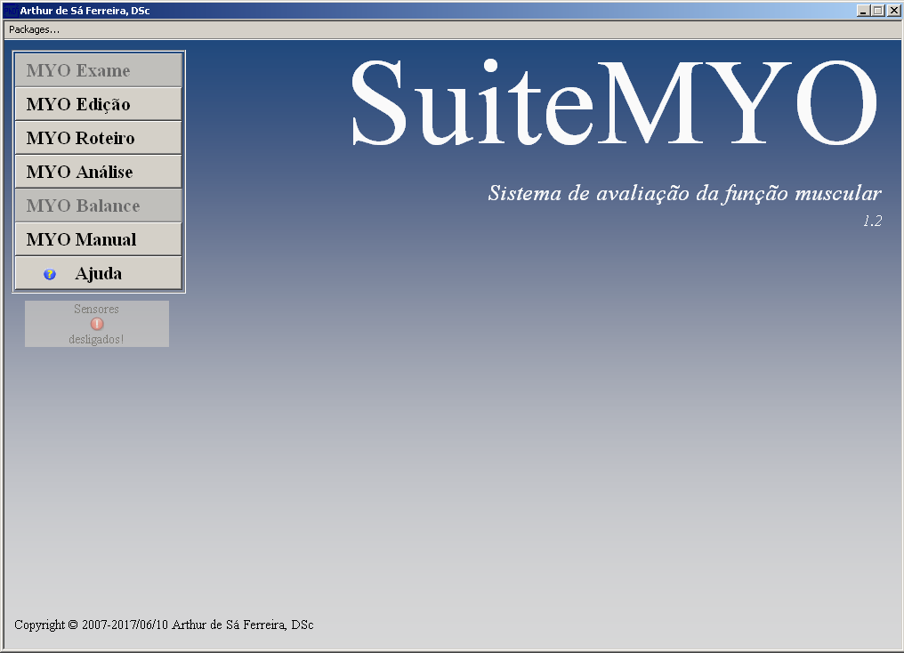
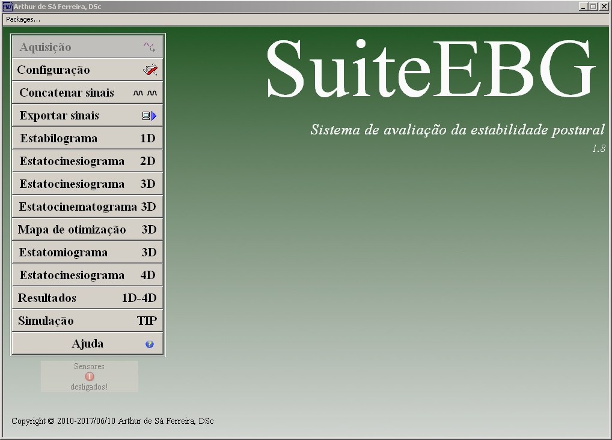
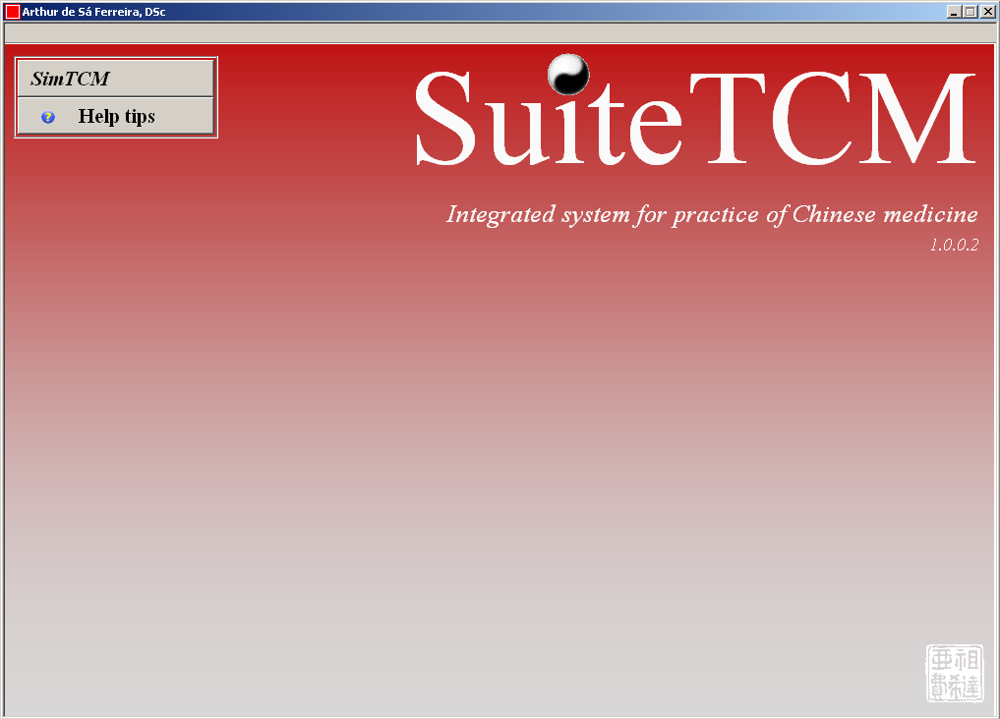

<!--install and/or load all R packages-->
```{r setup, include = FALSE, echo = FALSE, warning = FALSE, message = FALSE}
source("Scripts/all-required-packages.R")
```

<!--read additional files-->
```{r scimago-qualis, include = FALSE, echo = FALSE, warning = FALSE, message = FALSE}
# read SCImago csv file (download from https://www.scimagojr.com)
scimago <-
  read.csv(
    "SJR/scimagojr 2020.csv",
    header = TRUE,
    sep = ";",
    quote = "\"",
    dec = ",",
    fill = TRUE
  )

# read QUALIS xlsx file (download from https://www.scimagojr.com)
qualis <-
  data.frame(read_excel(
    "Qualis/QUALIS Referência 2017-2018.xlsx",
    sheet = 1,
    col_types = c("text")
  ))
```

<!--script for computer/mobile devices-->
```{css, echo=FALSE}
    <meta name="viewport" content="width=device-width, initial-scale=1.0">
    body .main-container {
      max-width: 1280px !important;
      width: 80%;
      margin: auto;
      }
    body {
      max-width: 1280px !important;
      width: 80%;
      margin: auto;
    }
      section {
      position: absolute;
      top: 50%;
      left: 50%;
      margin-right: -50%;
      transform: translate(-50%, -50%)
    }
```

<!--script for generating ALTMETRIC badges-->
<script type='text/javascript' src='https://d1bxh8uas1mnw7.cloudfront.net/assets/embed.js'></script>

<!--script for generating multiple DIMENSIONS badges-->
<script async src="https://badge.dimensions.ai/badge.js" charset="utf-8"></script>

<!--script for generating multiple PLUMX badges-->
<script type="text/javascript" src="//cdn.plu.mx/widget-all.js"></script>

<!--script for narrow margins-->
<style type="text/css">
div.main-container {
  max-width: 1800px;
  margin-left: auto;
  margin-right: auto;
}
</style>

<!--script for inserting LOGO ABOVE THE TOC-->
<script>
  $(document).ready(function() {
    $('#TOC').parent().prepend('<div id=\"nav_logo\"></div>');
  });
</script>
<style>
#nav_logo {
  width: 100%;
  margin-top: 20px;
}
</style>

<br>

<!--script for sharing-->
<p align="right">
```{r share, echo = FALSE, warning = FALSE, message = FALSE, fig.align = 'center', results = "asis"}
home <- "rehab-tech.github.io/observatoriocr/"
source("Scripts/social-media-sharing.R")
```
</p>

<br>

## **Trabalhos de conclusão** {#TCC}

<!--script for generating HORIZONTAL LINE-->
<hr style="height:2px;border-width:0;color:#2C3E50;background-color:#2C3E50">

### **Dissertações e Teses**

```{r tcc, echo = FALSE, warning = FALSE, message = FALSE, fig.align = 'center', results = "asis"}
options(knitr.kable.NA = '--', knitr.table.format = "html")

# tcc
sheet <- "TCC"
source("Scripts/read-xlsx-sucupira.R")

# get years
source("Scripts/years-sucupira.R")
names(sucupira.list) <- as.character(anos)

periodos <- names(sucupira.list)
periodo <- as.character(seq(min(periodos), max(periodos)))
tcc.all <- do.call(rbind.data.frame, sucupira.list[periodos])

tccs <- tcc.all

# select data
table.tcc <- cbind(format((as.Date(gsub("/", "-", tccs$'Data da Defesa'), "%d-%d-%Y")), "%Y"), tccs$`Tipo de Trabalho de Conclusão`, tccs$`Nome do Trabalho de Conclusão`, tccs$`Nome do Autor`, tccs$`Nome do Orientador`)
table.tcc <- table.tcc[order(table.tcc[, 1], table.tcc[, 2], table.tcc[, 3]), ]

# print tables
table.tcc[, 2] <- as.vector(unlist(lapply(table.tcc[, 2], FUN = str_to_title)))
table.tcc[, 3] <- as.vector(unlist(lapply(table.tcc[, 3], FUN = str_to_title)))
table.tcc[, 4] <- as.vector(unlist(lapply(table.tcc[, 4], FUN = str_to_title)))
table.tcc[, 5] <- as.vector(unlist(lapply(table.tcc[, 5], FUN = str_to_title)))

colnames(table.tcc) <- c("Ano", "Nível", "Título", "Autor", "Orientador")
datatable(table.tcc, rownames = FALSE, options=list(pageLength = 5, scrolX = F, dom = 'ftip', searchHighlight = TRUE), escape = FALSE)
```

<a style="float:right" href="#top"><b>Início &nbsp;</b>⬆️</a>

<br>

### **Repositórios** {.tabset}

#### **Institucional** {.tabset}

##### **Dissertações**

<iframe src="https://drive.google.com/embeddedfolderview?id=1k-1AJCm9n8k_yWuQANA7kjREj2N8dMWj#list" style="width:100%; height:600px; border:0;"></iframe>

<a style="float:right" href="#top"><b>Início &nbsp;</b>⬆️</a>

<br>

##### **Teses**

<iframe src="https://drive.google.com/embeddedfolderview?id=1VyudoKSCr_ElHSDUBK33xi2bYHzQpWgE#list" style="width:100%; height:600px; border:0;"></iframe>

<a style="float:right" href="#top"><b>Início &nbsp;</b>⬆️</a>

<br>

#### **Deposita IBICT**

<iframe src="https://deposita.ibict.br" style="width:100%; height:600px; border:0;"></iframe>

<a style="float:right" href="#top"><b>Início &nbsp;</b>⬆️</a>

<br>

#### **Catálogo CAPES**

<iframe src="https://catalogodeteses.capes.gov.br/catalogo-teses" style="width:100%; height:600px; border:0;"></iframe>

<a style="float:right" href="#top"><b>Início &nbsp;</b>⬆️</a>

<br>

### **Sistema de Submissão de TCC**

<iframe src="https://sstcc.unisuam.edu.br/" style="width:100%; height:600px; border:0;"></iframe>

<a style="float:right" href="#top"><b>Início &nbsp;</b>⬆️</a>

<br>

## **Produção bibliográfica** {#bibliografica}

<!--script for generating HORIZONTAL LINE-->
<hr style="height:2px;border-width:0;color:#2C3E50;background-color:#2C3E50">

### **Preprints** {.tabset}

<br>

```{r preprints, echo = FALSE, warning = FALSE, message = FALSE, fig.align = 'center', results = "asis", out.width = "80%"}
options(knitr.kable.NA = '--', knitr.table.format = "html")

# Step 4. Read in a CSV file into a data frame with a bunch of dois listed in one column.
all.dois <-
  data.frame(read_excel(
    "../PPGCR Unisuam/Produção.xlsx",
    sheet = "PI.preprints",
    col_types = c("text")
  ))

# Data cleaning
all.dois <- all.dois[complete.cases(all.dois$DOI),]

# get years
anos <- rev(unique(all.dois$Publicado.em))

for(ano in 1:length(anos)) {
  # Filtra por período
  dois <- all.dois[as.character(all.dois$Publicado.em) == as.character(anos[ano]),]
  # print tab header
  cat('\n\n<!-- -->\n\n')
  cat("#### **", anos[ano], "**", "\n", sep = "")

  # Verifica se há DOIs no período
  if (dim(dois)[1] == 0) {
    cat('\n')
    cat('*Sem produção para exibir no período*')
    cat('\n')
  } else {
    # Step 5. Convert the doi column in your dataset to a list.
    dois_list <- as.list(dois$DOI)
    
    # cria metadados para rastreio pelo Altmetric
    dois_2_meta <- dois$DOI
    source("scripts/altmetric-meta-from-dois.R")
    
    # roda o script para obter dados do Altmetric
    source("scripts/altmetric-from-dois.R")
    
    # get data of papers without Altmetric from CrossRef
    if (is_empty(no_altmetric_dois_list)) {
      my_dois_works <- no_altmetric_dois_list
    } else {
      my_dois_works <-
        rcrossref::cr_works(dois = unlist(no_altmetric_dois_list)) %>%
        pluck("data")
      # sort columns by title
      if (length(my_dois_works) != 0) {
        my_dois_works <-
          my_dois_works[order(as.vector(my_dois_works$title)),]
      }
    }
    
    # print table of papers with/without badges
    source("scripts/papers-with-badges.R")
    table.with.badges(
      show.Altmetric = TRUE,
      show.Dimensions = TRUE,
      show.PlumX = TRUE,
      show.SJR = FALSE,
      show.Qualis = FALSE,
      doi_sort,
      my_dois_works,
      scimago,
      qualis
    )
  }
}
```

<br>

### **Artigos completos em periódicos** {.tabset}

<br>

```{r artigos-completos, echo = FALSE, warning = FALSE, message = FALSE, fig.align = 'center', results = "asis", out.width = "80%"}
options(knitr.kable.NA = '--', knitr.table.format = "html")

# Step 4. Read in a CSV file into a data frame with a bunch of dois listed in one column.
all.dois <-
  data.frame(read_excel(
    "../PPGCR Unisuam/Produção.xlsx",
    sheet = "PI.completos",
    col_types = c("text")
  ))

# Data cleaning
all.dois <- all.dois[complete.cases(all.dois$DOI),]

# get years
anos <- rev(unique(all.dois$Publicado.em))

for(ano in 1:length(anos)) {
  # Filtra por período
  dois <- all.dois[as.character(all.dois$Publicado.em) == as.character(anos[ano]),]
  # print tab header
  cat('\n\n<!-- -->\n\n')
  cat("#### **", anos[ano], "**", "\n", sep = "")

  # Verifica se há DOIs no período
  if (dim(dois)[1] == 0) {
    cat('\n')
    cat('*Sem produção para exibir no período*')
    cat('\n')
  } else {
    # Step 5. Convert the doi column in your dataset to a list.
    dois_list <- as.list(dois$DOI)
    
    # cria metadados para rastreio pelo Altmetric
    dois_2_meta <- dois$DOI
    source("scripts/altmetric-meta-from-dois.R")
    
    # roda o script para obter dados do Altmetric
    source("scripts/altmetric-from-dois.R")
    
    # get data of papers without Altmetric from CrossRef
    if (is_empty(no_altmetric_dois_list)) {
      my_dois_works <- no_altmetric_dois_list
    } else {
      my_dois_works <-
        rcrossref::cr_works(dois = unlist(no_altmetric_dois_list)) %>%
        pluck("data")
      # sort columns by title
      if (length(my_dois_works) != 0) {
        my_dois_works <-
          my_dois_works[order(as.vector(my_dois_works$title)),]
      }
    }
    
    # print table of papers with/without badges
    source("scripts/papers-with-badges.R")
    table.with.badges(
      show.Altmetric = TRUE,
      show.Dimensions = TRUE,
      show.PlumX = TRUE,
      show.SJR = TRUE,
      show.Qualis = TRUE,
      doi_sort,
      my_dois_works,
      scimago,
      qualis
    )
  }
}
```

<br>

### **Artigos resumos em periódicos** {.tabset}

<br>

```{r artigos-resumos, echo = FALSE, warning = FALSE, message = FALSE, fig.align = 'center', results = "asis", out.width = "80%"}
options(knitr.kable.NA = '--', knitr.table.format = "html")

# Step 4. Read in a CSV file into a data frame with a bunch of dois listed in one column.
all.dois <-
  data.frame(read_excel(
    "../PPGCR Unisuam/Produção.xlsx",
    sheet = "PI.resumos",
    col_types = c("text")
  ))

# Data cleaning
all.dois <- all.dois[complete.cases(all.dois$DOI),]

# get years
anos <- rev(unique(all.dois$Publicado.em))

for(ano in 1:length(anos)) {
  # Filtra por período
  dois <- all.dois[as.character(all.dois$Publicado.em) == as.character(anos[ano]),]
  # print tab header
  cat('\n\n<!-- -->\n\n')
  cat("#### **", anos[ano], "**", "\n", sep = "")

  # Verifica se há DOIs no período
  if (dim(dois)[1] == 0) {
    cat('\n')
    cat('*Sem produção para exibir no período*')
    cat('\n')
  } else {
    # Step 5. Convert the doi column in your dataset to a list.
    dois_list <- as.list(dois$DOI)
    
    # cria metadados para rastreio pelo Altmetric
    dois_2_meta <- dois$DOI
    source("scripts/altmetric-meta-from-dois.R")
    
    # roda o script para obter dados do Altmetric
    source("scripts/altmetric-from-dois.R")
    
    # get data of papers without Altmetric from CrossRef
    if (is_empty(no_altmetric_dois_list)) {
      my_dois_works <- no_altmetric_dois_list
    } else {
      my_dois_works <-
        rcrossref::cr_works(dois = unlist(no_altmetric_dois_list)) %>%
        pluck("data")
      # sort columns by title
      if (length(my_dois_works) != 0) {
        my_dois_works <-
          my_dois_works[order(as.vector(my_dois_works$title)),]
      }
    }
    
    # print table of papers with/without badges
    source("scripts/papers-with-badges.R")
    table.with.badges(
      show.Altmetric = TRUE,
      show.Dimensions = TRUE,
      show.PlumX = TRUE,
      show.SJR = TRUE,
      show.Qualis = TRUE,
      doi_sort,
      my_dois_works,
      scimago,
      qualis
    )
  }
}
```

<br>

### **Livros e capítulos**  {.tabset}

<br>

```{r livros-capitulos, echo = FALSE, warning = FALSE, message = FALSE, fig.align = 'center', results = "asis", out.width = "80%"}
options(knitr.kable.NA = '--', knitr.table.format = "html")

# Step 4. Read in a CSV file into a data frame with a bunch of dois listed in one column.
all.dois <-
  data.frame(read_excel(
    "../PPGCR Unisuam/Produção.xlsx",
    sheet = "PI.livros",
    col_types = c("text")
  ))

# Data cleaning
all.dois <- all.dois[complete.cases(all.dois$DOI),]

# get years
anos <- rev(unique(all.dois$Publicado.em))

for(ano in 1:length(anos)) {
  # Filtra por período
  dois <- all.dois[as.character(all.dois$Publicado.em) == as.character(anos[ano]),]
  # print tab header
  cat('\n\n<!-- -->\n\n')
  cat("#### **", anos[ano], "**", "\n", sep = "")

  # Verifica se há DOIs no período
  if (dim(dois)[1] == 0) {
    cat('\n')
    cat('*Sem produção para exibir no período*')
    cat('\n')
  } else {
    # Step 5. Convert the doi column in your dataset to a list.
    dois_list <- as.list(dois$DOI)
    
    # cria metadados para rastreio pelo Altmetric
    dois_2_meta <- dois$DOI
    source("scripts/altmetric-meta-from-dois.R")
    
    # roda o script para obter dados do Altmetric
    source("scripts/altmetric-from-dois.R")
    
    # get data of papers without Altmetric from CrossRef
    if (is_empty(no_altmetric_dois_list)) {
      my_dois_works <- no_altmetric_dois_list
    } else {
      my_dois_works <-
        rcrossref::cr_works(dois = unlist(no_altmetric_dois_list)) %>%
        pluck("data")
      # sort columns by title
      if (length(my_dois_works) != 0) {
        my_dois_works <-
          my_dois_works[order(as.vector(my_dois_works$title)),]
      }
    }
    
    # print table of papers with/without badges
    source("scripts/papers-with-badges.R")
    table.with.badges(
      show.Altmetric = TRUE,
      show.Dimensions = TRUE,
      show.PlumX = TRUE,
      show.SJR = FALSE,
      show.Qualis = FALSE,
      doi_sort,
      my_dois_works,
      scimago,
      qualis
    )
  }
}
```

<br>

#### **Online**  {.tabset}

<br>

##### **Deficiência e inclusão pelo esporte no contexto militar**

<iframe src="https://www.editoracrv.com.br/produtos/detalhes/36691-crv" style="width:100%; height:600px; border:0;"></iframe>

<a style="float:right" href="#top"><b>Início &nbsp;</b>⬆️</a>

<br>

##### **O Gol de Rodas**

<iframe src="https://ogolderodas.com.br" style="width:100%; height:600px; border:0;"></iframe>

<a style="float:right" href="#top"><b>Início &nbsp;</b>⬆️</a>

<br>

##### **Uma Jornada para Entender a Dor**

<iframe src="http://pesquisaemdor.com.br" style="width:100%; height:600px; border:0;"></iframe>

<a style="float:right" href="#top"><b>Início &nbsp;</b>⬆️</a>

<br>

##### **Livros do Museu do Esporte**

<iframe src="https://www.emuseudoesporte.com.br/br/home" style="width:100%; height:600px; border:0;"></iframe>

<a style="float:right" href="#top"><b>Início &nbsp;</b>⬆️</a>

<br>

## **Produção técnica** {#tecnica}

<!--script for generating HORIZONTAL LINE-->
<hr style="height:2px;border-width:0;color:#2C3E50;background-color:#2C3E50">

### **Trabalhos em anais de eventos** {.tabset}

```{r resumos-eventos, echo = FALSE, warning = FALSE, message = FALSE, fig.align = 'center', results = "asis", out.width = "80%"}
options(knitr.kable.NA = '--', knitr.table.format = "html")

# Step 4. Read in a CSV file into a data frame with a bunch of dois listed in one column.
all.dois <-
  data.frame(read_excel(
    "../PPGCR Unisuam/Produção.xlsx",
    sheet = "PI.eventos",
    col_types = c("text")
  ))

# Data cleaning
all.dois <- all.dois[complete.cases(all.dois$DOI),]

# get years
anos <- rev(unique(all.dois$Publicado.em))

for(ano in 1:length(anos)) {
  # Filtra por período
  dois <- all.dois[as.character(all.dois$Publicado.em) == as.character(anos[ano]),]
  # print tab header
  cat('\n\n<!-- -->\n\n')
  cat("#### **", anos[ano], "**", "\n", sep = "")

  # Verifica se há DOIs no período
  if (dim(dois)[1] == 0) {
    cat('\n')
    cat('*Sem produção para exibir no período*')
    cat('\n')
  } else {
    # Step 5. Convert the doi column in your dataset to a list.
    dois_list <- as.list(dois$DOI)
    
    # cria metadados para rastreio pelo Altmetric
    dois_2_meta <- dois$DOI
    source("scripts/altmetric-meta-from-dois.R")
    
    # roda o script para obter dados do Altmetric
    source("scripts/altmetric-from-dois.R")
    
    # get data of papers without Altmetric from CrossRef
    if (is_empty(no_altmetric_dois_list)) {
      my_dois_works <- no_altmetric_dois_list
    } else {
      my_dois_works <-
        rcrossref::cr_works(dois = unlist(no_altmetric_dois_list)) %>%
        pluck("data")
      # sort columns by title
      if (length(my_dois_works) != 0) {
        my_dois_works <-
          my_dois_works[order(as.vector(my_dois_works$title)),]
      }
    }
    
    # print table of papers with/without badges
    source("scripts/papers-with-badges.R")
    table.with.badges(
      show.Altmetric = TRUE,
      show.Dimensions = TRUE,
      show.PlumX = TRUE,
      show.SJR = TRUE,
      show.Qualis = TRUE,
      doi_sort,
      my_dois_works,
      scimago,
      qualis
    )
  }
}
```

<br>

### **Bancos de dados** {.tabset}

<!--script for generating HORIZONTAL LINE-->
<hr style="height:2px;border-width:0;color:#2C3E50;background-color:#2C3E50">

```{r datasets, echo = FALSE, warning = FALSE, message = FALSE, fig.align = 'center', results = "asis", out.width = "80%"}
options(knitr.kable.NA = '--', knitr.table.format = "html")

# Step 4. Read in a CSV file into a data frame with a bunch of dois listed in one column.
all.dois <-
  data.frame(read_excel(
    "../PPGCR Unisuam/Produção.xlsx",
    sheet = "PI.datasets",
    col_types = c("text")
  ))

# Data cleaning
all.dois <- all.dois[complete.cases(all.dois$DOI),]

# get years
anos <- rev(unique(all.dois$Publicado.em))

for(ano in 1:length(anos)) {
  # Filtra por período
  dois <- all.dois[as.character(all.dois$Publicado.em) == as.character(anos[ano]),]
  # print tab header
  cat('\n\n<!-- -->\n\n')
  cat("#### **", anos[ano], "**", "\n", sep = "")

  # Verifica se há DOIs no período
  if (dim(dois)[1] == 0) {
    cat('\n')
    cat('*Sem produção para exibir no período*')
    cat('\n')
  } else {
    # Step 5. Convert the doi column in your dataset to a list.
    dois_list <- as.list(dois$DOI)
    
    # cria metadados para rastreio pelo Altmetric
    dois_2_meta <- dois$DOI
    source("scripts/altmetric-meta-from-dois.R")
    
    # roda o script para obter dados do Altmetric
    source("scripts/altmetric-from-dois.R")
    
    # get data of papers without Altmetric from CrossRef
    if (is_empty(no_altmetric_dois_list)) {
      my_dois_works <- no_altmetric_dois_list
    } else {
      my_dois_works <-
        rcrossref::cr_works(dois = unlist(no_altmetric_dois_list)) %>%
        pluck("data")
      # sort columns by title
      if (length(my_dois_works) != 0) {
        my_dois_works <-
          my_dois_works[order(as.vector(my_dois_works$title)),]
      }
    }
    
    # print table of papers with/without badges
    source("scripts/papers-with-badges.R")
    table.with.badges(
      show.Altmetric = TRUE,
      show.Dimensions = TRUE,
      show.PlumX = TRUE,
      show.SJR = FALSE,
      show.Qualis = FALSE,
      doi_sort,
      my_dois_works,
      scimago,
      qualis
    )
  }
}
```

<br>

### **Desenvolvimento de aplicativos** {.tabset}

<!--script for generating HORIZONTAL LINE-->
<hr style="height:2px;border-width:0;color:#2C3E50;background-color:#2C3E50">

#### **SuiteMYO**

```{r softwares-myo, echo = FALSE, warning = FALSE, message = FALSE, fig.align='center', results = "asis", out.width="80%"}
options(knitr.kable.NA = '--', knitr.table.format = "html")

# read separate sheets
softwares.raw <- read_excel("../PPGCR Unisuam/Softwares.xlsx", sheet = "SuiteMYO", col_types = c("text"))

# replace the link by a tag
for(i in 1:dim(softwares.raw)[1]){
  softwares.raw[i,3] <- paste("[↗️](", softwares.raw[i,3], '){target="_blank"}', sep = "")
}

# print table
print(kable(softwares.raw, align = c("l", rep("c", ncol(softwares.raw)-2), "r")) %>% kable_styling(bootstrap_options = c("striped", "hover", "condensed", "responsive"), full_width = T, position = "center"))

```

<style>
th, td {
  padding: 10px;
}
</style>
<table class="center">
  <tr>
    <td>
      [](https://drive.google.com/file/d/1SbGREXOSVq0KxWEPxJQP1-t_2A6j57-c/view?usp=sharing){target="_blank"}
    </td>
  </tr>
</table>

<a style="float:right" href="#top"><b>Início &nbsp;</b>⬆️</a>

<br>

#### **SuiteEBG**

```{r softwares-ebg, echo = FALSE, warning = FALSE, message = FALSE, fig.align='center', results = "asis", out.width="80%"}
options(knitr.kable.NA = '--', knitr.table.format = "html")

# read separate sheets
softwares.raw <- read_excel("../PPGCR Unisuam/Softwares.xlsx", sheet = "SuiteEBG", col_types = c("text"))

# replace the link by a tag
for(i in 1:dim(softwares.raw)[1]){
  softwares.raw[i,3] <- paste("[↗️](", softwares.raw[i,3], '){target="_blank"}', sep = "")
}

# print table
print(kable(softwares.raw, align = c("l", rep("c", ncol(softwares.raw)-2), "r")) %>% kable_styling(bootstrap_options = c("striped", "hover", "condensed", "responsive"), full_width = T, position = "center"))

```

<style>
th, td {
  padding: 10px;
}
</style>
<table class="center">
  <tr>
    <td>
      [](https://drive.google.com/file/d/1TSzz64zTI7-6C-38k4hO_CMqSGOrbe-I/view?usp=sharing){target="_blank"}
    </td>
  </tr>
</table>

<a style="float:right" href="#top"><b>Início &nbsp;</b>⬆️</a>

<br>

#### **SuiteTCM**

```{r softwares-tcm, echo = FALSE, warning = FALSE, message = FALSE, fig.align='center', results = "asis", out.width="80%"}
options(knitr.kable.NA = '--', knitr.table.format = "html")

# read separate sheets
softwares.raw <- read_excel("../PPGCR Unisuam/Softwares.xlsx", sheet = "SuiteTCM", col_types = c("text"))

# replace the link by a tag
for(i in 1:dim(softwares.raw)[1]){
  softwares.raw[i,3] <- paste("[↗️](", softwares.raw[i,3], '){target="_blank"}', sep = "")
}

# print table
print(kable(softwares.raw, align = c("l", rep("c", ncol(softwares.raw)-2), "r")) %>% kable_styling(bootstrap_options = c("striped", "hover", "condensed", "responsive"), full_width = T, position = "center"))

```

<style>
th, td {
  padding: 10px;
}
</style>
<table class="center">
  <tr>
    <td>
      [](https://drive.google.com/file/d/18-LCadmw-phwueqSrrIBsfgtirX6SYHW/view?usp=sharing){target="_blank"}
    </td>
  </tr>
</table>

<a style="float:right" href="#top"><b>Início &nbsp;</b>⬆️</a>

<br>

#### **PainMAP**

<br>

*Em construção*

<a style="float:right" href="#top"><b>Início &nbsp;</b>⬆️</a>

<br>

#### **Fitaro**

<br>

<iframe src="https://fitaro.com.br" style="width:100%; height:600px; border:0;"></iframe>

<a style="float:right" href="#top"><b>Início &nbsp;</b>⬆️</a>

<br>

## **Registros de protocolos** {#registros .tabset}

<!--script for generating HORIZONTAL LINE-->
<hr style="height:2px;border-width:0;color:#2C3E50;background-color:#2C3E50">

### **ClinicalTrials.gov**

<br>

<iframe src="https://clinicaltrials.gov" style="width:100%; height:600px; border:0;"></iframe>

<br>

*Fontes:* [**Fundação Oswaldo Cruz)**](https://clinicaltrials.gov)

<br>

<a style="float:right" href="#top"><b>Início &nbsp;</b>⬆️</a>

<br>

### **ReBEC**

<br>

<iframe src="https://ensaiosclinicos.gov.br" style="width:100%; height:600px; border:0;"></iframe>

<br>

*Fontes:* [**Fundação Oswaldo Cruz)**](https://ensaiosclinicos.gov.br)

<br>

<a style="float:right" href="#top"><b>Início &nbsp;</b>⬆️</a>

<br>

### **PROSPERO**

<br>

<iframe src="https://www.crd.york.ac.uk/prospero/#loginpage" style="width:100%; height:600px; border:0;"></iframe>

<br>

*Fontes:* [**National Institute for Health Research**](https://www.crd.york.ac.uk/prospero/#loginpage)

<br>

<a style="float:right" href="#top"><b>Início &nbsp;</b>⬆️</a>

<br>

### **PRECIS-2**

<br>

<iframe src="https://www.precis-2.org" style="width:100%; height:600px; border:0;"></iframe>

<br>

*Fontes:* [**Health Informatics Centre (University of Dundee)**](https://www.precis-2.org)

<br>

<a style="float:right" href="#top"><b>Início &nbsp;</b>⬆️</a>

<br>

### **WHO UTN**

<br>

<iframe src="https://www.who.int/clinical-trials-registry-platform/unambiguous-trial-identification/the-universal-trial-number-(utn)" style="width:100%; height:600px; border:0;"></iframe>

<br>

*Fontes:* [**World Health Organization**](https://www.who.int/clinical-trials-registry-platform/unambiguous-trial-identification/the-universal-trial-number-(utn))

<br>

<a style="float:right" href="#top"><b>Início &nbsp;</b>⬆️</a>
